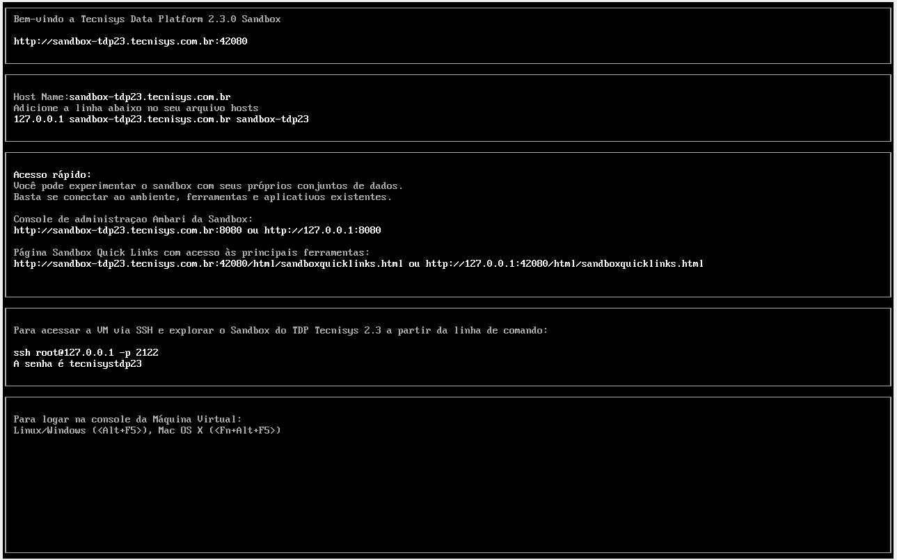
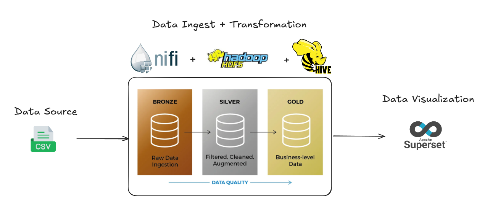
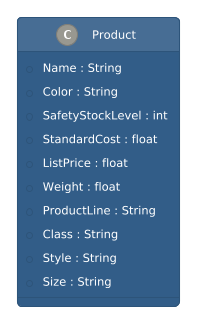
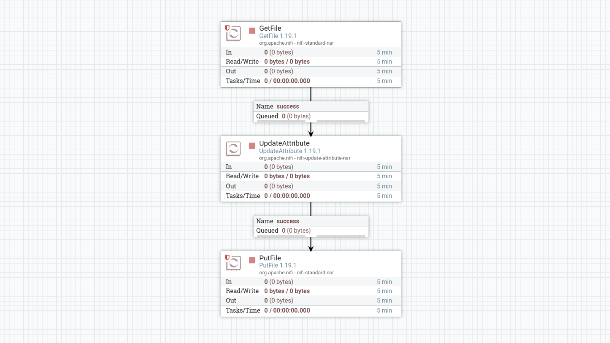
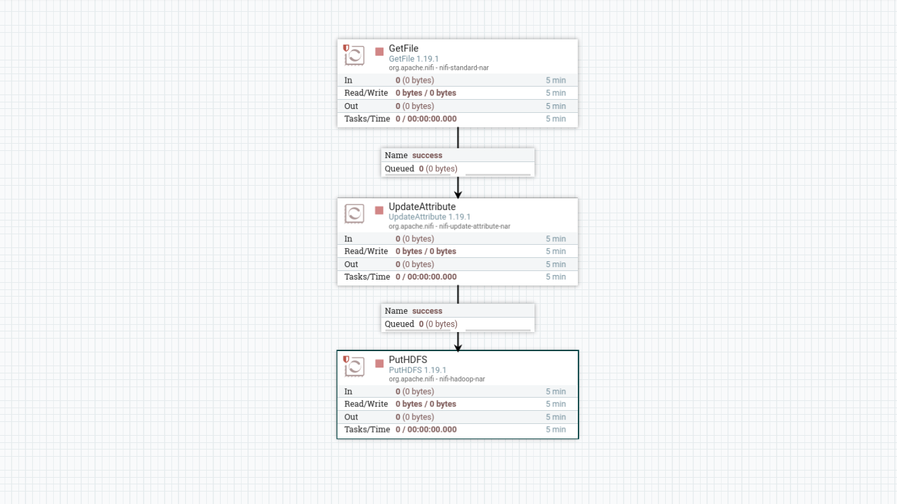
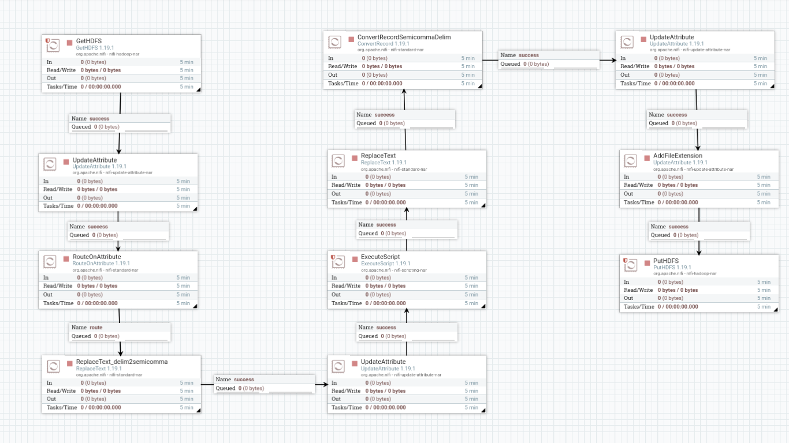
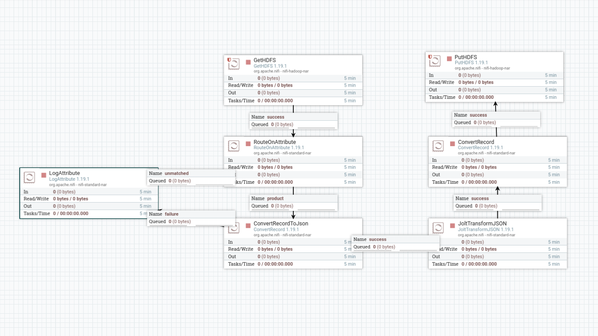
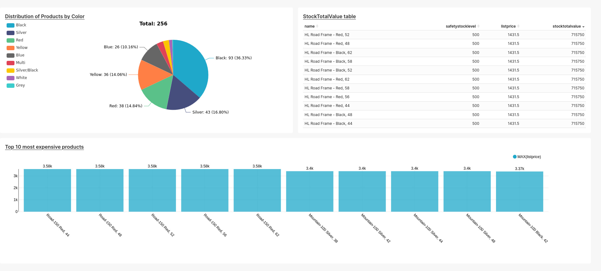

# Utilizando Tecnisys TDP Sandbox - Pipeline end-to-end de relatório de indicadores de produto utilizando Nifi e SuperSet
 

## 1. Introdução

Todo este projeto foi desenvolvido no **Sandbox do TDP** ([https://docs.tecnisys.com.br/tdp/commons/sandbox](https://docs.tecnisys.com.br/tdp/commons/sandbox)), que oferece um ambiente completo e integrado voltado para experimentação e desenvolvimento com dados.



*Figura 1: Tela inicial da Sandbox TDP*

Relatórios de negócios precisam ser rápidos, objetivos e sempre atualizados. Como engenheiro de dados, estou constantemente em busca de maneiras de tornar esse processo mais eficiente. Pensando nisso, desenvolvi este projeto para demonstrar, de ponta a ponta, a construção de um pipeline moderno utilizando a Tecnisys Data Platform (TDP).

O TDP é uma plataforma open source que integra diversas ferramentas para ingestão, transformação, governança, análise e visualização de dados. Com ela, é possível orquestrar todo o fluxo de engenharia de dados em um único ambiente, de forma prática e escalável.

A ideia era simples: simular dados realistas de produtos, limpá-los e transformá-los usando as ferramentas integradas do TDP, e criar um dashboard voltado para stakeholders que fosse atualizado automaticamente.

O TDP oferece uma experiência perfeita ao lidar com uma variedade de ferramentas e funcionalidades, permitindo que o gestor se concentre no que realmente importa: seus dados. A plataforma é projetada para atender às necessidades de tratamento de dados, independentemente da escala ou complexidade, proporcionando um ecossistema integrado que facilita todo o processo de engenharia de dados.

Apesar dos dados serem fictícios, a estrutura e o fluxo refletem situações reais de negócios, incluindo os KPIs. Este documento percorre todo o processo — desde a compreensão das necessidades do negócio até a construção de visualizações que realmente agregam valor.

## 2. Objetivo

O principal objetivo deste projeto é **transformar dados transacionais brutos em métricas limpas e confiáveis, automatizando a entrega desses insights para stakeholders**.

Para alcançar isso, o projeto focou em:

*   **Construir um pipeline de dados robusto** que processe dados de forma consistente e confiável
*   **Implementar a arquitetura Medallion** (Bronze, Silver, Gold) para garantir qualidade e governança dos dados
*   **Automatizar processos de limpeza e transformação** usando Apache NiFi para orquestração
*   **Criar visualizações significativas** que forneçam insights acionáveis para tomada de decisão
*   **Estabelecer um fluxo de trabalho escalável** que possa ser replicado em ambientes de produção

Ao final, consegui um sistema funcional que reflete o tipo de infraestrutura de relatórios na qual muitas empresas confiam — e uma compreensão mais sólida do que é necessário para entregar dados que não sejam apenas limpos, mas genuinamente úteis.



*Figura 2: Diagrama de fluxo de trabalho*


### Descrição do Caso de Uso

Este projeto demonstra a construção de um pipeline de dados completo utilizando **NiFi, Hive, HDFS e Superset**, seguindo a arquitetura Medallion (camadas Bronze, Silver e Gold). Dados brutos em CSV são ingeridos e tratados no NiFi, disponibilizados em tabelas Hive externas no data lake, e visualizados em dashboards interativos no Superset.

### Objetivo Principal e Importância do Projeto

O objetivo é apresentar as capacidades de um pipeline de dados moderno e abrangente, aplicável a análises de produtos, monitoramento de indicadores e dados operacionais.

## 3. Tech Stack

Para este projeto, a seguinte stack de tecnologias foi utilizada:

| Camada | Ferramenta/Serviço | Propósito |
|---|---|---|
| Ingestão e Orquestração | Apache NiFi | Responsável por orquestrar a movimentação e manipulação inicial dos dados, garantindo ingestão eficiente e confiável. |
| Armazenamento Distribuído | HDFS (Hadoop Distributed File System) | Armazena os dados organizados em camadas (Bronze, Silver, Gold), fornecendo uma base escalável e confiável para o pipeline. |
| Estruturação e Consulta | Apache Hive | Permite estruturar e consultar dados no data lake (HDFS) utilizando SQL-like, preparando-os para análise. |
| Visualização e Dashboards | Apache Superset | Permite consumir os dados do Hive para criar gráficos e dashboards interativos, transformando dados em insights acionáveis. |

**Nota**: Em um ambiente de produção com maiores volumes ou mais dependências, eu provavelmente usaria Apache Airflow para orquestrar o agendamento das tarefas. No entanto, para este projeto, optei por manter a simplicidade e demonstrar o que é possível construir utilizando apenas as ferramentas nativas de agendamento do NiFi e a capacidade de integração entre os componentes do TDP. O foco foi provar que é possível construir um fluxo de relatórios completo sem a necessidade de uma camada de orquestração adicional.


## 4. Data Schema & Design

Para simular um ambiente de relatórios realista, a arquitetura do pipeline de dados foi estruturada em três camadas principais, seguindo o modelo Medallion: Bronze, Silver e Gold. Cada camada serve a um propósito específico na organização e processamento dos dados.



*Figura 3: Schema de dados do produto*

### Camadas do Pipeline

*   **Camada Bronze**: Armazena os dados brutos, exatamente como foram coletados, sem transformações. Esta camada é fundamental para auditorias e para permitir o retrabalho futuro, se necessário.
*   **Camada Silver**: Contém dados limpos e padronizados, prontos para consultas mais rápidas e manipulações intermediárias. Nesta camada, formatos otimizados como Parquet são introduzidos para melhorar o desempenho.
*   **Camada Gold**: Apresenta dados agregados e otimizados, organizados de acordo com os requisitos finais de consumo, como relatórios e visualizações. Esta é a camada de onde o Superset consumirá os dados.

### Arquivo CSV de Produto (Exemplo)

O exemplo de conjunto de dados utilizado é o `Product.csv`, que contém informações detalhadas sobre peças de bicicletas. Este arquivo é uma amostra oficial extraída do repositório [GitHub da Microsoft](https://github.com/microsoft/sql-server-samples/tree/master/samples/databases/adventure-works/oltp-install-script). 

Embora o arquivo original contenha 27 colunas, após o processo de transformação e limpeza de dados na camada **Gold**, a estrutura é simplificada para 10 colunas essenciais para análise e visualização. A importância desses dados reside em sua capacidade de fornecer insights sobre o portfólio de produtos, permitindo análises de estoque, vendas e tendências de mercado. 

A tabela a seguir ilustra a estrutura esperada na camada **Gold**:

| Coluna | Descrição |
|---|---|
| Name | Nome do produto. |
| Color | Cor do produto. |
| SafetyStockLevel | Nível de estoque de segurança do produto. |
| StandardCost | Custo padrão do produto. |
| ListPrice | Preço de lista do produto. |
| Weight | Peso do produto. |
| ProductLine | Linha de produto (e.g., M para Mountain, R para Road). |
| Class | Classe do produto (e.g., L para Low, M para Medium, H para High). |
| Style | Estilo do produto (e.g., U para Universal, W para Women's, M para Men's). |
| Size | Tamanho do produto. |


## 5. Data Cleaning & Transformation no NiFi

A etapa de limpeza e transformação dos dados é crucial para garantir a qualidade e a usabilidade das informações. Neste projeto, o Apache NiFi desempenha um papel central na orquestração desses processos, movendo e manipulando os dados através das diferentes camadas da arquitetura Medallion.

### Orquestração de Dados na Camada Bronze: 'Incoming to Processed'

O primeiro fluxo no NiFi é responsável por mover os dados brutos do diretório `incoming` para o diretório `processed` no sistema de arquivos local. Este processo organiza os arquivos por data, criando uma estrutura clara para o histórico dos dados. Os processadores utilizados são `GetFile`, `UpdateAttribute` e `PutFile`.

#### Processadores NiFi Utilizados:

*   **GetFile**: Recupera o arquivo `Product.csv` do diretório de entrada (`/home/data/edge/incoming`). Configurado para rodar uma vez ao dia e apagar o arquivo de origem após o processamento.
*   **UpdateAttribute**: Cria atributos dinâmicos para o caminho do diretório (`relativePath`) e um carimbo de data/hora (`timestamp`) com a data atual formatada. Isso garante que os arquivos sejam organizados por data no diretório de destino.
*   **PutFile**: Salva o arquivo no diretório `processed`, utilizando o caminho dinâmico gerado pelo `UpdateAttribute` (ex: `/home/data/edge/processed/production/product/{YYYY-MM-DD}`). Em caso de conflito, o arquivo existente é substituído, e diretórios ausentes são criados automaticamente.



*Figura 4: Processadores no NiFi para a camada Processed*

Ao final deste processo, o arquivo `Product.csv` estará organizado por data, pronto para ser movido para a camada Bronze no HDFS.


### Orquestração de Dados na Camada Bronze: 'Processed to Bronze Layer'

Após a organização inicial dos arquivos, o próximo fluxo no NiFi move os dados do diretório `processed` para a camada Bronze no HDFS. Esta etapa é crucial para garantir que os dados brutos sejam armazenados de forma persistente e imutável, sem qualquer alteração em sua estrutura original. Isso permite auditorias futuras e a capacidade de reprocessar os dados a partir de sua forma original, se necessário.

#### Processadores NiFi Utilizados:

*   **GetFile**: Recupera o arquivo `Product.csv` do diretório `processed`. Este processador é configurado para rodar diariamente e, diferentemente do fluxo anterior, mantém o arquivo de origem no diretório `processed` após a cópia para o HDFS.
*   **UpdateAttribute**: Cria um atributo `relativePath` com base no caminho absoluto do arquivo no diretório `processed`. Este atributo é usado para replicar a estrutura de diretórios no HDFS, garantindo consistência na organização dos dados.
*   **PutHDFS**: Salva o arquivo no HDFS, especificamente na camada Bronze. As configurações incluem o caminho para os arquivos de configuração do Hadoop (`/etc/hadoop/conf/core-site.xml,/etc/hadoop/conf/hdfs-site.xml`) para garantir a conectividade. O diretório de destino no HDFS é `/bronze/${relativePath}`, o que significa que a estrutura de pastas original é mantida. A estratégia de resolução de conflitos é `replace`, e a estratégia de escrita é `Write and rename` para evitar corrupção de dados durante a transferência.



*Figura 5: Processadores no NiFi para a camada Bronze*

Com a conclusão deste fluxo, os dados brutos estão seguramente armazenados na camada Bronze do HDFS, prontos para as próximas etapas de transformação e refinamento nas camadas Silver e Gold.


### Transformação de Dados: Camada Bronze para Silver

Esta fase do pipeline no NiFi é responsável por transformar e mover os dados da camada Bronze (dados brutos) para a camada Silver (dados limpos e padronizados) no HDFS. O objetivo principal é refinar os dados, padronizá-los e convertê-los para um formato otimizado para análise, como o Parquet.

#### Fluxo Geral dos Processadores no NiFi:

O fluxo de transformação envolve uma sequência de processadores que realizam as seguintes operações:

1.  **GetHDFS**: Recupera os arquivos da camada Bronze no HDFS.
2.  **UpdateAttribute**: Armazena informações úteis, como a data atual e o caminho relativo do arquivo, para auxiliar na organização e no processamento.
3.  **RouteOnAttribute**: Classifica os arquivos com base em atributos (por exemplo, tipo de arquivo) para direcioná-los a rotas de processamento específicas.
4.  **ReplaceText (1)**: Substitui delimitadores nos arquivos CSV (se aplicável), padronizando-os para um formato consistente (e.g., ponto e vírgula `;`).
5.  **UpdateAttribute (2)**: Armazena o nome do arquivo sem a extensão, facilitando a manipulação posterior.
6.  **ExecuteScript**: Utiliza um script Groovy para definir cabeçalhos dinâmicos com base no nome do arquivo, garantindo que os dados sejam corretamente interpretados.
7.  **ReplaceText (2)**: Adiciona o cabeçalho correspondente ao arquivo na primeira linha, preparando-o para a conversão de formato.
8.  **ConvertRecord**: Este é um processador chave que converte os arquivos CSV para o formato Parquet. Ele utiliza **Controller Services** específicos para leitura (CSVReader) e escrita (ParquetRecordSetWriter) de registros, garantindo a correta interpretação do esquema e a otimização do formato de saída.
9.  **UpdateAttribute (3) e (4)**: Configuram e adicionam atributos para o diretório de saída no HDFS, organizando os arquivos por data e estrutura lógica.
10. **PutHDFS**: Grava os arquivos convertidos e padronizados no HDFS, na camada Silver.



*Figura 6: Processadores no NiFi para a camada Silver*

#### Controller Services Essenciais:

*   **CSVReader**: Configurado para inferir automaticamente o esquema dos arquivos CSV, definir formatos de data/hora e especificar o delimitador (ponto e vírgula). Isso garante que o NiFi possa ler corretamente os dados brutos.
*   **ParquetRecordSetWriter**: Responsável por escrever os dados no formato Parquet. Ele herda o esquema do CSVReader e permite configurações como tipo de compressão (neste caso, `UNCOMPRESSED`), tamanho do grupo de linhas e cache, otimizando o armazenamento e a performance de leitura.

Ao final deste processo, os dados estarão na camada Silver, no formato Parquet, organizados por data, prontos para serem utilizados na camada Gold para análises mais complexas e criação de dashboards.


### Otimização e Agregação de Dados: Camada Silver para Gold

A camada Gold representa a etapa final do pipeline de dados, onde as informações são otimizadas, enriquecidas e organizadas para consumo por ferramentas de Business Intelligence (BI) e Machine Learning. Este fluxo no NiFi transforma os dados da camada Silver (formato Parquet) para a camada Gold, selecionando apenas os atributos mais relevantes e garantindo alta performance na leitura e manipulação.

#### Processadores NiFi Utilizados:

*   **GetHDFS**: Recupera os arquivos `Product.parquet` do diretório `/silver` no HDFS. Configurado para leitura recursiva e para manter os arquivos de origem após a cópia.
*   **RouteOnAttribute**: Identifica o arquivo `Product.parquet` para direcionar o fluxo de processamento específico. Isso permite a manipulação de diferentes tipos de arquivos de forma modular.
*   **ConvertRecord (Parquet para JSON)**: Converte os dados do formato Parquet para JSON. Esta conversão é necessária para facilitar a manipulação e a seleção de colunas usando o processador JoltTransformJson.
*   **JoltTransformJson**: Este é um processador crucial para a transformação e seleção de colunas. Ele aplica uma especificação Jolt (JSON to JSON Transformation Language) para mapear e reorganizar os atributos. No caso do `Product.parquet`, ele seleciona as 10 colunas finais que comporão a tabela na camada Gold, descartando as demais e garantindo uma estrutura otimizada para análise.
*   **ConvertRecord (JSON para Parquet)**: Converte os dados de volta para o formato Parquet após a transformação Jolt. Isso mantém a otimização de armazenamento e performance para a camada Gold.
*   **PutHDFS**: Salva o arquivo transformado no diretório `/gold` do HDFS. A estratégia de resolução de conflitos é `replace`, e a estratégia de escrita é `Write and rename` para garantir a integridade dos dados.



*Figura 7: Processadores no NiFi para a camada Gold*

Com a conclusão deste fluxo, os dados na camada Gold estão limpos, organizados e otimizados, prontos para serem consumidos por ferramentas analíticas e de visualização, como o Superset.


### Criando Tabela Gold no Apache Hive

Após a preparação dos dados nas camadas Bronze e Silver, a próxima etapa é criar uma tabela externa no Apache Hive que referencie a camada Gold armazenada no HDFS. Essa tabela será o ponto de acesso para ferramentas de BI, como o Apache Superset, e outros sistemas analíticos.

O Hive permite a criação de tabelas externas que apontam diretamente para os dados no HDFS, sem a necessidade de movê-los. Isso garante flexibilidade e desempenho, especialmente para grandes volumes de dados. A tabela `gold_product_tb` é criada com a seguinte estrutura:

```sql
CREATE EXTERNAL TABLE IF NOT EXISTS gold_product_tb (
    Name STRING,
    Color STRING,
    SafetyStockLevel INT,
    StandardCost DOUBLE,
    ListPrice DOUBLE,
    Weight DOUBLE,
    ProductLine STRING,
    Class STRING,
    Style STRING,
    Size STRING
)
STORED AS PARQUET
LOCATION 
'/gold';
```

**Características da Tabela:**

*   **Tabela Externa**: Permite acessar os dados diretamente no HDFS, mantendo a independência entre os dados e o esquema da tabela.
*   **Formato Parquet**: Os dados são armazenados no formato Parquet, otimizado para leitura e compressão eficiente, o que melhora significativamente o desempenho das consultas.
*   **Colunas Selecionadas**: As colunas representam os atributos principais do produto, como `Name`, `Color`, `ListPrice`, entre outros, conforme definido na etapa de transformação para a camada Gold.

Após a criação, a tabela pode ser validada com comandos Hive como `show tables;`, `desc gold_product_tb;` e `select * from gold_product_tb limit 10;` para garantir que os dados estão acessíveis e corretos. Com essa tabela configurada, os dados estão prontos para serem consumidos e visualizados em dashboards dinâmicos.


## 6. Construindo o Dashboard no Apache Superset

O Apache Superset é uma ferramenta poderosa para visualização de dados e criação de dashboards interativos. Após a criação da tabela `gold_product_tb` no Hive, o próximo passo é conectar o Superset a essa fonte de dados, criar gráficos relevantes e montar um dashboard completo para análises estratégicas.

### Conectando o Hive ao Superset

Para começar, é necessário configurar a conexão do Superset com o Hive. Isso é feito acessando as configurações de conexão de banco de dados no Superset e fornecendo os detalhes de conexão do Hive. Uma vez estabelecida, essa conexão permite que o Superset acesse a tabela `gold_product_tb` e utilize seus dados para criar visualizações.

### KPIs Displayed e Visual Sections

Para demonstrar as capacidades do Superset, foram criados três tipos de visualizações principais, que podem ser combinadas em um dashboard para fornecer uma visão consolidada do portfólio de produtos:

#### 1. Tabela de StockTotalValue

Esta tabela exibe o valor total de estoque calculado por produto. É uma visualização crucial para equipes de estoque e planejamento, pois permite identificar rapidamente o capital imobilizado em cada item.

*   **Dimensões**: `name` (Nome do produto), `safetystocklevel` (Nível de estoque de segurança), `listprice` (Preço unitário).
*   **Métrica Calculada**: `stocktotalvalue` (calculado como `listprice * safetystocklevel`).
*   **Filtros**: `listprice > 0` (exclui produtos com preço zero).

#### 2. Gráfico de Barras: Top 10 Produtos Mais Caros

Este gráfico de barras visualiza os 10 produtos com os maiores preços unitários. É útil para equipes de vendas e marketing identificarem produtos premium e desenvolverem estratégias de precificação e promoção.

*   **Métricas**: `listprice` (Preço unitário).
*   **Dimensões**: `name` (Nome do produto).
*   **Limites**: Top 10 produtos.
*   **Ordenação**: Decrescente por `listprice` (máximo).

#### 3. Gráfico de Pizza: Distribuição de Produtos por Cor

Este gráfico de pizza mostra a distribuição percentual de produtos por cor. Essa visualização pode fornecer insights sobre as preferências dos clientes e auxiliar no planejamento de produção e design de produtos.

*   **Dimensões**: `color` (Cor dos produtos).
*   **Métricas**: Contagem de produtos por `color`.
*   **Filtros**: `color is not null` (exclui valores nulos).
*   **Ordenação**: Pelo total da métrica.

### Criando o Dashboard

Com os gráficos e tabelas configurados, eles são combinados em um dashboard interativo no Superset. O dashboard oferece uma visão consolidada e estratégica do portfólio de produtos, permitindo:

*   Monitorar a distribuição por cores.
*   Identificar os itens mais caros.
*   Analisar o valor total de estoque.



*Figura 8. Dashboard no Superset*

Este dashboard é uma ferramenta essencial para equipes de estoque, vendas, marketing e executivos, fornecendo insights sobre tendências de mercado, preferências de clientes e a relação entre capital imobilizado e demanda. Ele facilita a identificação de padrões e oportunidades, como ajustes no planejamento de produção, campanhas para produtos premium e estratégias para otimizar o estoque e reduzir custos. Seu valor reside em centralizar informações críticas para tomadas de decisão rápidas e assertivas, garantindo melhores resultados financeiros e maior agilidade na gestão.

## 7. Conclusão

Este projeto demonstrou a construção de um pipeline de dados completo, desde a ingestão de dados brutos até a visualização em um dashboard interativo. Através da utilização de ferramentas como NiFi, Hive, HDFS e Superset, e seguindo a arquitetura Medallion, foi possível transformar dados brutos em insights estratégicos e acionáveis. 

O processo incluiu a limpeza e transformação de dados no NiFi, a organização em camadas Bronze, Silver e Gold no HDFS, a criação de tabelas externas no Hive para acesso otimizado, e a construção de dashboards no Superset para visualização e análise de KPIs. Este pipeline serve como um modelo robusto para qualquer iniciativa de análise de produtos, monitoramento de indicadores e dados operacionais, capacitando as equipes a tomar decisões baseadas em dados confiáveis e aprimorar a eficiência operacional.


