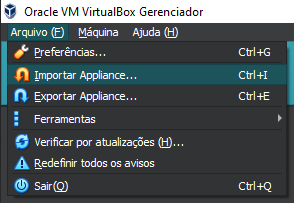
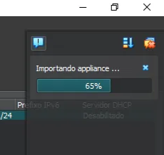
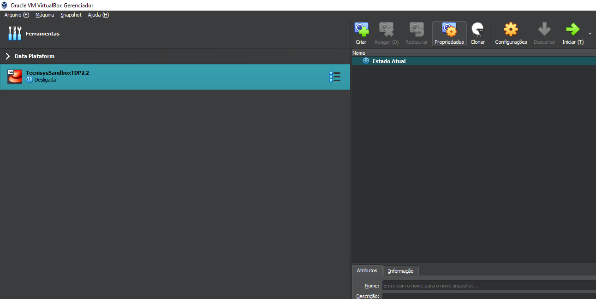
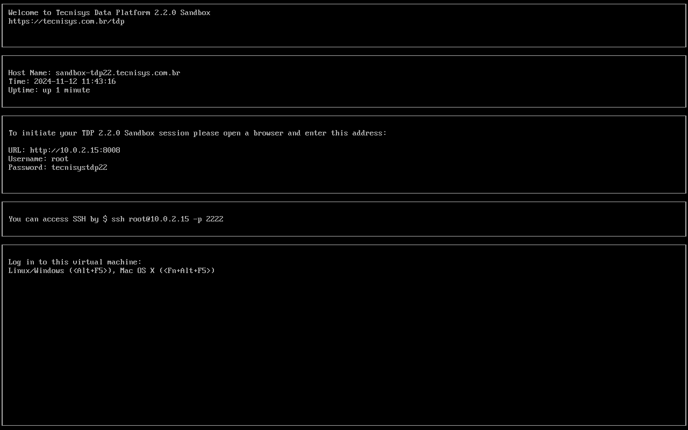
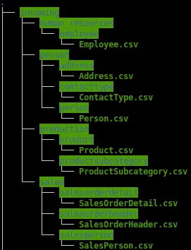
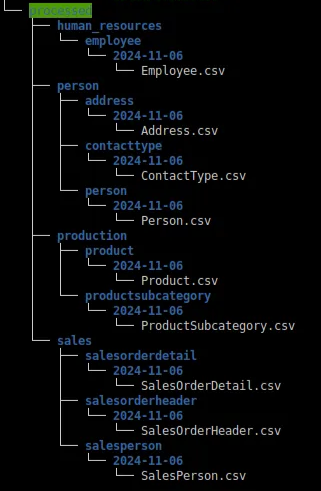

# Desvendando o Potencial de Dados com TDP: Um Tutorial end-to-end com Pipeline e Visualização de Dados de Produtos para Tomada de Decisão

Utilize um tutorial completo e transforme um arquivo csv com Hive e Nifi em um pipeline de dados e visualize em dashboards elaborados no Superset.
---

## **Introdução**

Neste guia, você aprenderá a utilizar e explorar o total potencial da Tecnisys Data Platform (TDP) usando sua sandbox. Ao final do tutorial, você concluirá com sucesso o **consumo, limpeza, manipulação completa dados, criação tabelas no Hive, execução de fluxos no Nifi e visualização de dashboards elaborados no Superset**. Vamos começar!
---

## **O que é a Tecnisys Data Platform?**

A Tecnisys Data Platform (TDP) é uma solução abrangente e totalmente open source para gestão, transformação e análise de dados de uma empresa brasileira. O TDP viabiliza todo um completo stack de uma plataforma de dados moderna, desde o processamento distribuído até governança de dados, proporcionando resultados rápidos com baixo custo. A plataforma oferece extrema flexibilidade para customizações e possui contínuas atualizações.

A Tecnisys oferece suporte e atendimento à 100% da solução para organizações que necessitam de atendimento corporativo.

https://www.tecnisys.com.br/

https://docs.tecnisys.com.br/main/index.html
---

## **O que é a Sandbox?**

O Sandbox é um ambiente controlado para aprendizado, testes e exploração da plataforma da Tecnisys, e oferece todos os recursos funcionais de uma solução completa limitado apenas pelos seus recursos configurados. Facilitando o primeiro contato e rápido domínio das funcionalidades, produtos, operações e resultados que a plataforma pode entregar.

Para maiores informações, leia os tutoriais:
---

## **Caso de Uso: Pipeline de Dados**

O caso de uso consiste em um pipeline de dados completo realizado com o NiFi, o qual faz a ingestão e o tratamento de arquivos csv brutos. Utilizando da arquitetura Medallion (camadas bronze, prata e ouro), os dados do caso de uso utiliza a arquitetura de dados mais utilizada atualmente. Esse modelo de organização aprimora a qualidade e a otimização dos dados processados, também trabalhando manipulações de arquivo para os formatos parquet e JSON, facilitando a gestão e o consumo em diferentes iniciativas de dados. 

Após o tratamento dos dados, os mesmos são disponibilizados em um data lake, através de uma conexão com tabelas Hive, para consumo, visualização e análise no Superset. O Superset é a ferramenta (equivalente ao Tableau e Power BI, só que 100% open source) onde é possível criar dashboards interativos com gráficos e tabelas sofisticadas para a apresentação clara e informativa das informações processadas.
---

## **Inicialização do Ambiente**

1. **Requisitos Mínimos**
    - Sistema Operacional: Windows 10/11 ou Linux com Virtual Box 7 ou superior.
    - Processador: 4 VCPUs disponíveis.
    - Memória RAM: 10 GB.
    - Espaço em Disco: 100 GB iniciais podendo chegar a 140gb.
---
## **Instalação da Sandbox**

Para começar, baixe o arquivo `.ova` da sandbox e siga estas etapas para configurá-lo no VirtualBox:

1. Abra o VirtualBox e vá em `Arquivo → Importar Appliance` ou use o atalho `Ctrl + I`.
    
    
    
2. Selecione o arquivo `.ova` da SandboxTDP que você baixou e clique em `Próximo`.
    
    
    
3. Clique em `Finalizar` para iniciar a importação da máquina virtual.
    
    
    
4. Aceite a licença de uso da SandboxTDP clicando em `Concordo`.
    
    
    
5. Aguarde a importação do arquivo `.ova`, o que pode levar alguns minutos
    
    
    
6. Após a importação, inicie a máquina virtual.
    
    
    

1. Espere a sandbox iniciar e exibir a tela inicial customizada.
    
    
    

A sandbox está agora pronta para uso!

---

## **Acesso e Inicialização de Serviços**

1. **Acesso ao Ambari**
    
    URL de acesso: porta 42080.
    
2. **Acesso SSH**
    
    Conecte-se ao servidor via SSH com o comando abaixo:
    
    ```powershell
    ssh -p 2122 devopstdp@localhost
    tecnisystdp23
    ```
    
3. **Inicialização de Serviços**
    
    No Ambari, inicialize os serviços necessários na interface.
    
    - HDFS
    - 

---

## **Execução do Caso de Uso: Passo a Passo**

### Passo inicial

1. **Acesse o diretório Assets**
    
    Nos arquivos baixados do GitHub, localize o diretório `Assets`.
    
2. **Alimentação do Diretório Inicial**
    
    Copie todo o conteúdo de `Assets` para o diretório `/home`.
    
    Estrutura esperada: `/home/data/edge/…`
    
    
    
3. **Configuração de Permissões**
    
    Dê permissão aos diretórios com o comando:
    
    ```powershell
    chmod -R 777 /home/data
    ```
    

---

### Processos no NiFi

### Passos Iniciais

1. **Criação de Diretórios no HDFS**
    
    Acesse o HDFS e crie os diretórios necessários com permissões:
    
    ```powershell
    ssh -p 2122 devopstdp@localhost
    tecnisystdp23
    
    su - hdfs
    hdfs dfs -mkdir /bronze /silver /gold
    hdfs dfs -chmod 777 /bronze /silver /gold
    ```
    
2. **Acesse o diretório do NiFi**
    
    Nos arquivos do GitHub, localize o diretório do NiFi.
    
3. **Importe o Template no NiFi**
    
    No NiFi, importe o template `.xml`:
    
    
    
4. **Execute o Caso de Uso**
    
    Após importar, clique com o botão direito e selecione `Start` para executar o fluxo:
    
    
    

---

### **Descrição dos Pipelines**

1. **Pipeline “Incoming to Processed”**
    
    Move dados de `incoming` para `processed` uma vez ao dia, organizando-os por data.
    
    **Verificação**: Confira os arquivos com o comando:
    
    ```powershell
    tree /home/data/edge/processed
    ```
    
    
    
2. **Pipeline “Processed to HDFS Bronze Layer”**
    
    Copia arquivos de `processed` para a camada `bronze` no HDFS.
    
3. **Pipeline “Bronze to Silver”**
    
    Padroniza e limpa dados, convertendo-os para o formato Parquet.
    
4. **Pipeline “Silver to Gold”**
    
    Transforma dados de Parquet para JSON com `JoltTransformJson`.
    

### 2. Pipeline “Processed to HDFS Bronze Layer”

Copia os arquivos raw de `processed` para a camada bronze no HDFS.

### 3. Pipeline “Bronze to Silver”

Padroniza limpa e converte os arquivos para o formato Parquet.

### 4. Pipeline “Silver to Gold”

Realiza a ultima limpeza e seleção dos dados que serão utilizados para criação de gráficos e dashboards valiosos no Superset.

---

### Criação da Tabela Externa no Hive

1. **Acesse o diretório do Hive**
    
    Encontre o diretório do Hive nos arquivos baixados do GitHub, onde está o script para criar a tabela externa.
    
2. **Entre no Hive pelo terminal**
    
    Abra o terminal e digite os comandos abaixo para acessar o Hive:
    
    ```powershell
    ssh -p 2122 devopstdp@localhost
    tecnisystdp23
    
    su - hive
    hive
    ```
    
3. **Execute o script de criação da tabela**
    
    Copie e cole o script do arquivo `create_external_table.txt` para criar a tabela externa:
    
    ```powershell
    CREATE EXTERNAL TABLE IF NOT EXISTS gold_product_tb (
        Name STRING,
        Color STRING,
        SafetyStockLevel INT,
        StandardCost DOUBLE,
        ListPrice DOUBLE,
        Weight DOUBLE,
        ProductLine STRING,
        Class STRING,
        Style STRING,
        Size STRING
    )
    	STORED AS PARQUET
    LOCATION '/gold';
    ```
    
4. Verifique se a tabela foi criada
    
    No terminal do Hive, use o comando abaixo para confirmar que a tabela foi criada:
    
    ```powershell
    show tables;
    ```
    

A tabela externa deve estar pronta para uso após esses passos.

---

### Conexão e Visualização no Superset

1. Acesse o diretório do Superset
    
    Nos arquivos baixados do GitHub, localize o diretório do Superset.
    
2. Importe o arquivo zipado no Superset
    
    No Superset, importe o arquivo `.zip` que contém o dashboard e os gráficos:
    
    
    
3. Visualize o conteúdo importado
    
    O Superset agora exibirá o dashboard, gráficos, dataset e a conexão com o Hive prontos para uso:
    
    
    
    Dashboard gerado pelo caso de uso
    

Dashboard gerado: visualização dos dados do caso de uso

- **Gráfico de pizza**: distribuição de produtos por cor
- **Gráfico de barras**: top 10 produtos mais caros
- **Tabela**: produtos ordenados pelo maior valor de estoque

---

## **Conclusão**

A sandbox da Tecnisys Data Platform proporciona um ambiente seguro e completo para experimentar e entender o poder da TDP. Com suas funcionalidades de ingestão, tratamento e visualização, essa solução oferece a flexibilidade e o desempenho necessários para atender a diferentes cenários de uso. Explore, crie e transforme dados, simplificando processos e extraindo valor para sua organização!