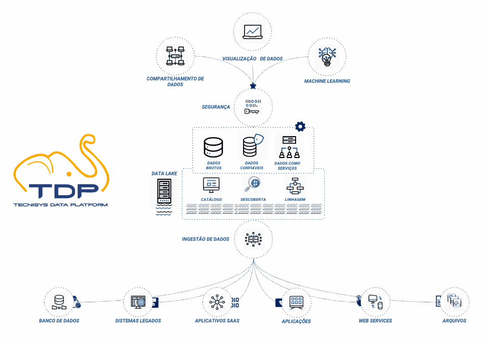
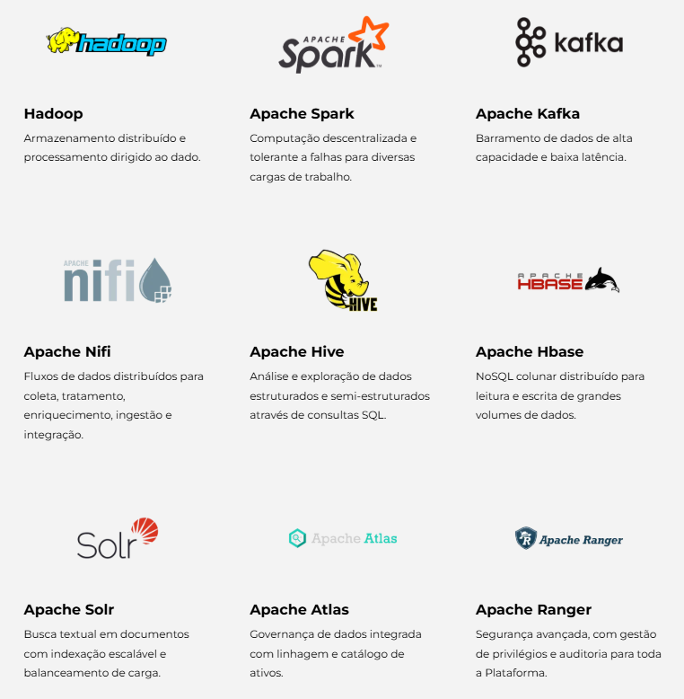

# **Por dentro da Tecnisys Data Platform**

## **O que é a Tecnisys Data Plataform?**  
A Tecnisys Data Platform (TDP) é uma solução completa e Open Source para  gestão, transformação, processamento, análise e ciência de dados. Com recursos poderosos e uma abordagem abrangente, o TDP é a resposta para os desafios únicos que sua organização enfrenta na gestão e análise de dados.

## **Governança, Processamento, Big Data...**
O TDP foi desenvolvido para simplificar o tratamento de dados, oferecendo uma ampla gama de soluções integradas. Desde processamento e armazenamento distribuído até governança de dados, a Tecnisys Data Platform oferece uma abordagem holística para impulsionar a eficiência dos seus processos.

    

## **Ecossistema Integrado**
O TDP oferece uma experiência perfeita ao lidar com uma variedade de ferramentas e funcionalidades, permitindo que o gestor se concentre no que realmente importa: seus dados. Nossa plataforma é projetada para atender às necessidades de tratamento de dados, independentemente da escala ou complexidade.

    