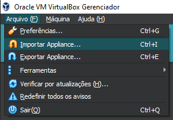
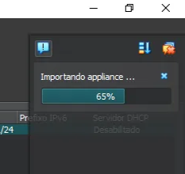
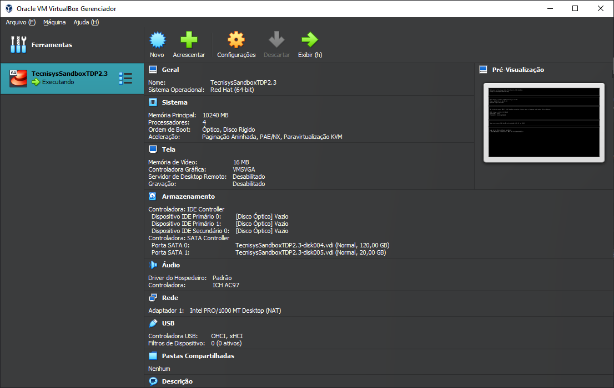
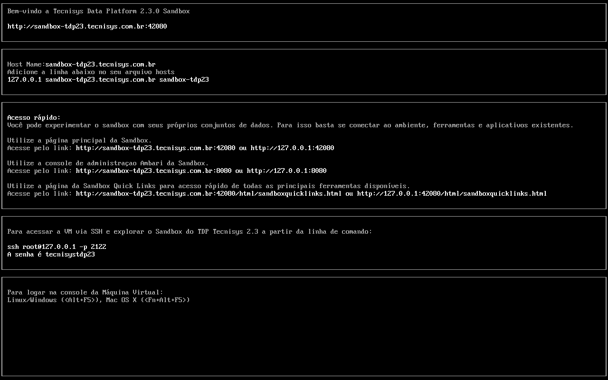

# **Criação do Sandbox TDP**
Para criar o Sandbox, é necessário que o VirtualBox já esteja instalado e configurado corretamente. Com esse requisito atendido, podemos seguir com o processo de criação conforme descrito a seguir.

1. Abra o VirtualBox e vá em `Arquivo → Importar Appliance` ou use o atalho `Ctrl + I`.
    
    
    
2. Selecione o arquivo `.ova` da SandboxTDP que você baixou e clique em `Próximo`.
    
    
    
3. Clique em `Finalizar` para iniciar a importação da máquina virtual.
    
    
    
4. Aceite a licença de uso da SandboxTDP clicando em `Concordo`.
    
    
    
5. Aguarde a importação do arquivo `.ova`, o que pode levar alguns minutos
    
    
    
6. Após a importação, inicie a máquina virtual.
    
    
    
7. Espere a sandbox iniciar e exibir a tela inicial customizada.
    
    
    

A sandbox está agora pronta para uso!