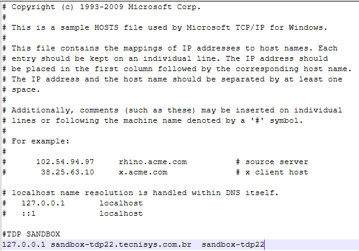

# Configurando o Host Local com o Domínio TDP

Ao configurar uma máquina virtual (VM) ou aplicações em ambientes locais, é altamente recomendado associar o domínio da máquina ao `localhost`. Isso facilita o redirecionamento de portas e a simulação de ambientes reais sem depender de servidores externos. Vamos aprender como configurar o arquivo `hosts` no Linux e no Windows para associar o IP `127.0.0.1` a um domínio como `sandbox-tdp22.tecnisys.com.br`.

## O que é o arquivo `hosts` e por que configurá-lo?

O arquivo `hosts` é uma configuração local presente em sistemas operacionais como Linux e Windows. Ele serve para mapear nomes de domínio (como `sandbox-tdp22.tecnisys.com.br`) para endereços IP, substituindo a necessidade de uma consulta DNS.

No caso de redirecionamento de portas de uma VM, essa configuração permite acessar serviços locais ou de uma máquina virtual como se fossem hospedados em um domínio público. Isso é útil para:

- Testar ambientes de desenvolvimento.
- Evitar conflitos com outras aplicações que compartilham o mesmo endereço IP.
- Simular URLs de produção em um ambiente local

## Configuração no Linux

- **Abra o arquivo `hosts` no editor de texto de sua escolha.**
    
    Use o comando abaixo para abrir o arquivo no modo de edição:
    
```
sudo vi /etc/hosts
```
    
- **Adicione o mapeamento do IP.**
    
    Inclua a linha abaixo no final do arquivo:
    
```
127.0.0.1 sandbox-tdp22.tecnisys.com.br
```
    
- **Salve e feche o arquivo.**
    
    No `vi`, pressione `ESC`, digite `:wq` e pressione `Enter`.
    

## Configuração no Windows

- **Localize o arquivo `hosts`.**
    
    O arquivo está localizado em:
    
```
C:\Windows\System32\drivers\etc\hosts
```
    
- **Abra o arquivo com permissões administrativas.**
    - Clique com o botão direito no **Bloco de Notas** e selecione **Executar como administrador**.
    - No Bloco de Notas, abra o arquivo mencionado acima.
- **Adicione o mapeamento do IP.**
    
    Insira a linha abaixo no final do arquivo:
    
```
127.0.0.1 sandbox-tdp22.tecnisys.com.br
```
    
    
    
- **Salve o arquivo.**