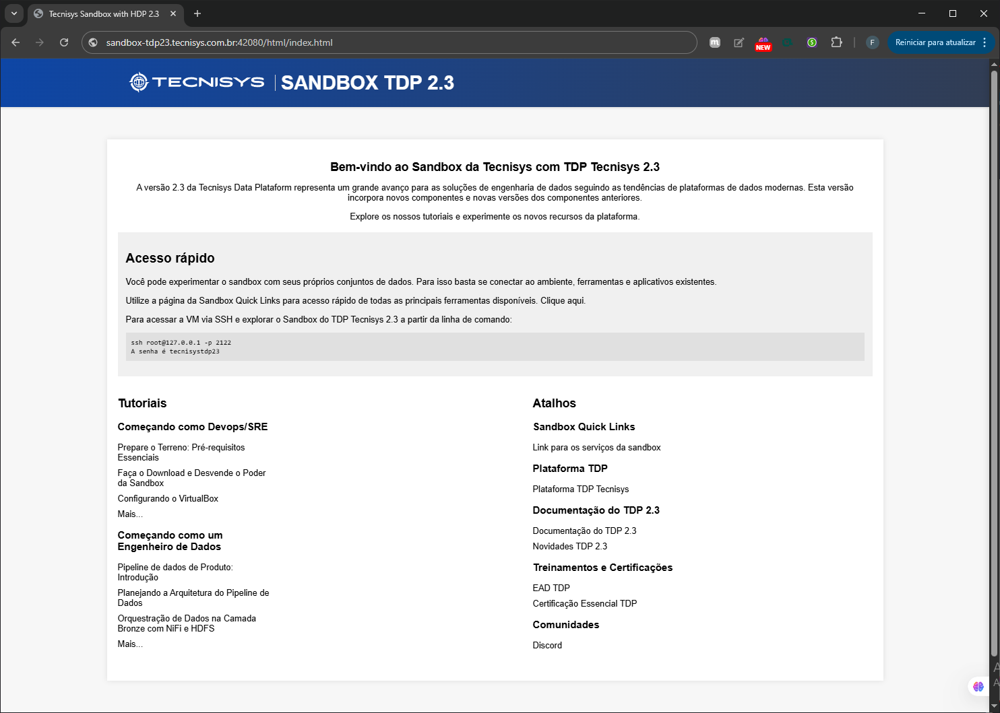
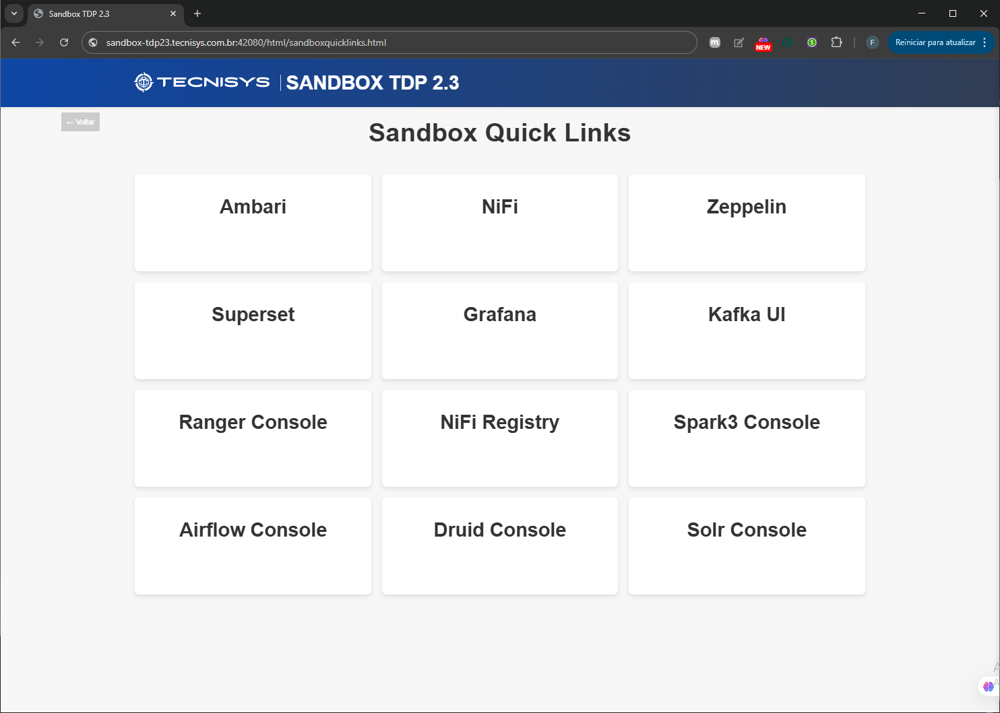
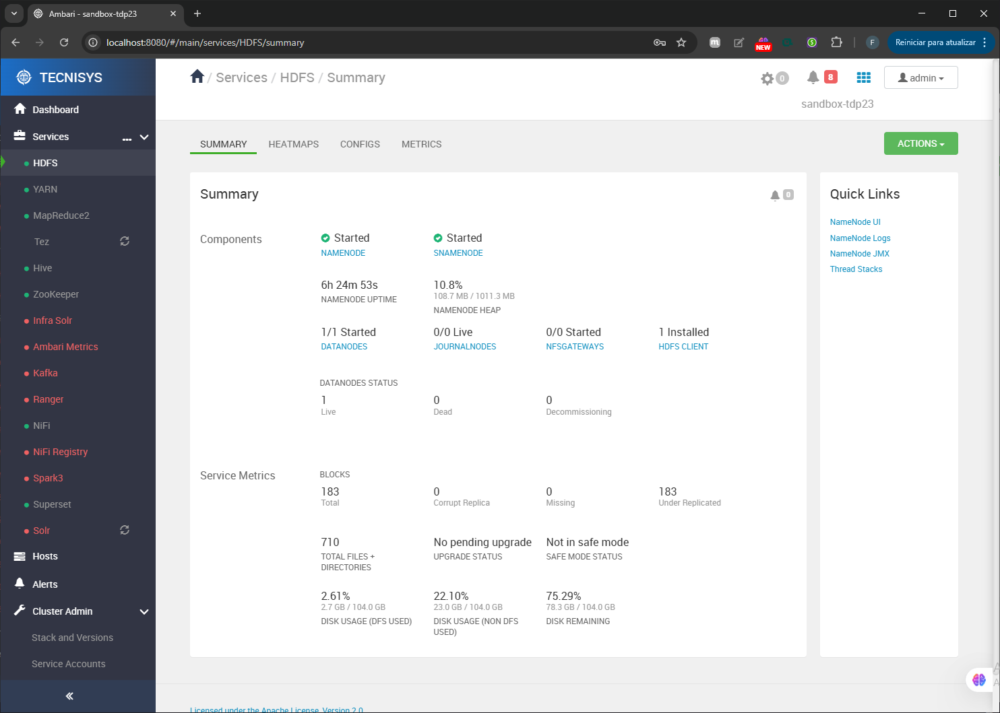
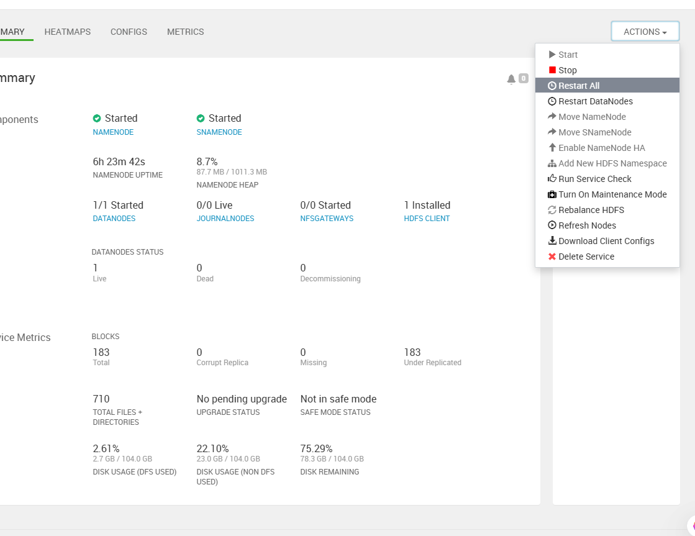

# Guia Prático da Exploração da Sandbox

## O que é a Sandbox TDP?
A sandbox TDP é uma máquina virtual pré-configurada que simula o ambiente da plataforma de dados TDP. Ele permite explorar funcionalidades como:

- Ingestão e transformação de dados.
- Execução de pipelines de dados.
- Testes de integrações com ferramentas analíticas.

A sandbox inclui ferramentas essenciais da plataforma TDP, permitindo que você aprenda sem precisar configurar um cluster real. 

Essa solução é ideal para desenvolvedores, analistas de dados e administradores que desejam experimentar recursos avançados de manipulação, processamento e análise de dados antes de implementá-los em produção.

Este guia ajudará você a acessar e começar a usar a sandbox TDP em poucos passos.

---
## Acessando o Ambiente
Uma vez que a sandbox esteja em execução, você pode acessá-lo pelo navegador ou via terminal.


**Acesse o ambiente web:**

- **Abra o navegador e digite o endereço da sandbox. O padrão geralmente é:**
```
http://localhost:42080
```

- **Caso tenha configurado um domínio local (como vimos no guia de `hosts`), use `sandbox-tdp22.tecnisys.com.br`:**
```
http://sandbox-tdp22.tecnisys.com.br:42080
```

### Acessar página inicial do TDP
A página inicial da sandbox oferece um botão chamado **Quick Links**, que direciona você para uma página com links rápidos para acessar serviços essenciais do cluster.



### Links Rápidos da Sandbox
Os links rápidos fornecem acesso a serviços integrados da plataforma TDP, permitindo que você interaja com ferramentas importantes para gerenciamento e análise de dados.


## **Acesso ao Ambari:**
Para realizar o login no Ambari, use as credenciais padrão fornecidas com a sandbox. 
- Usuário `admin`
- Senha `admin`


Selecione a aplicação de interesse



Inicie as aplicação clicando em `Actions → Restart All`



## **Acesso via SSH:**
Para usuários avançados, conecte-se ao terminal da sandbox via SSH na porta `2122`:

```
ssh -p 2122 devopstdp@localhost
senha:tecnisystdp22
```

