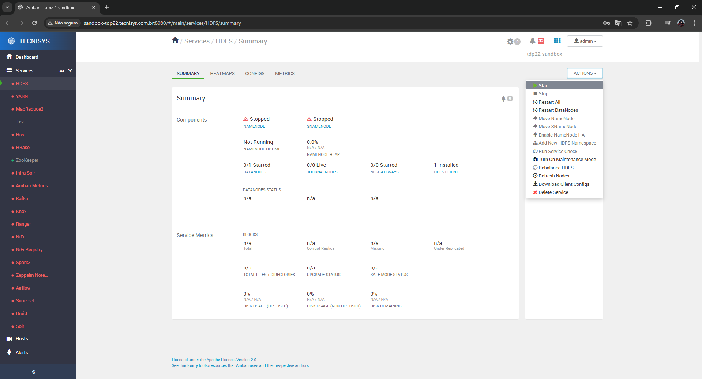

# Configurando o Repositório TDP com .netrc

## O que é o `.netrc`?
O arquivo `.netrc` será utilizado como uma forma segura de autenticação no repositório da Tecnisys para garantir o funcionamento correto da **Sandbox**. A Sandbox depende de pacotes hospedados nos repositórios da Tecnisys, que requerem autenticação para serem acessados. O `.netrc` armazena as credenciais (usuário e senha) para esses repositórios de forma segura, sem a necessidade de expô-las diretamente na configuração dos arquivos de repositório.


## **Passo 1: Ajustar as Credenciais no `.netrc`**

1. Localize o arquivo `.netrc` no diretório `/root`:
    
```
ls -l /root/.netrc
```

2. Edite o arquivo para atualizar as credenciais:
    
```
sudo vi /root/.netrc
```
    
- O conteúdo do arquivo deve seguir este formato:
    
```
machine repo.tecnisys.com.br login SEU_USUARIO password SUA_SENHA
```
    
- Substitua `SEU_USUARIO` e `SUA_SENHA` pelas credenciais fornecidas pela Tecnisys.


3. Verifique as permissões do arquivo para garantir segurança:
    
```
chmod 600 /root/.netrc
```
    

## **Passo 2: Testar a Configuração**

1. Limpe o cache do Yum/DNF:
    
```
sudo yum clean all
```
    
2. Atualize a lista de repositórios:
    
```
sudo yum repolist
```
    
Se tudo estiver configurado corretamente, você verá a lista de pacotes disponíveis.


3. Inicie uma aplicação no Ambari com Actions → Start
