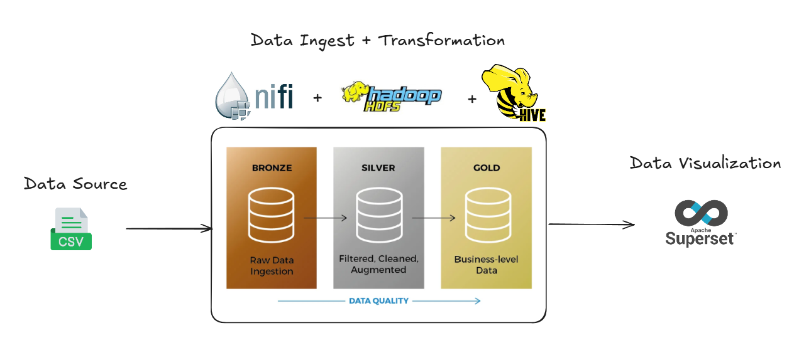

# **Planejando a Arquitetura do Pipeline de Dados**

## Introdução ao pipeline

    

O pipeline de dados organiza, transforma e disponibiliza informações para consumo, permitindo análises eficientes. Os arquivos começam como CSV no diretório `incoming`, são processados, transformados e armazenados em diferentes camadas no HDFS utilizando uma arquitetura Medallion (Bronze, Silver e Gold). Por fim, os dados são consumidos em dashboards interativos no Superset.

## Camadas do Pipeline
- **Camada Bronze**: armazena os dados brutos, exatamente como foram coletados, sem transformações. Ideal para auditorias ou retrabalho futuro.
- **Camada Silver**: contém dados limpos e padronizados, prontos para consultas mais rápidas e manipulações intermediárias. É aqui que formatos como Parquet são introduzidos para melhorar o desempenho.
- **Camada Gold**: dados agregados e otimizados, organizados de acordo com os requisitos finais de consumo, como relatórios ou visualizações.

## Pipelines no NiFi
- *“Incoming to Processed”*: Move dados de incoming para processed uma vez ao dia, organizando-os por data.
- *“Processed to Bronze*: Copia os arquivos raw de `processed` para a camada bronze no HDFS.
- *“Bronze to Silver”*: Padroniza limpa e converte os arquivos para o formato Parquet.
- *“Silver to Gold”*: Realiza a ultima limpeza e seleção dos dados que serão utilizados para criação de gráficos e dashboards valiosos no Superset.

## Integração entre as ferramentas
Cada ferramenta desempenha um papel essencial no pipeline:

- **NiFi**: responsável por orquestrar a movimentação e manipulação inicial dos dados, garantindo ingestão eficiente e confiável.
- **HDFS**: armazena os dados organizados em camadas, fornecendo uma base escalável e confiável para o pipeline.
- **Hive**: gera tabelas externas que estruturam os dados para análises e visualizações.
- **Superset**: permite consumir os dados do Hive para criar gráficos e dashboards interativos.

## Arquivo CSV de Produto

O arquivo `Product.csv` que será utilizado neste exemplo contém informações sobre diversos produtos e foi extraído de um conjunto de dados de amostra fornecido pela Microsoft. O arquivo pode ser encontrado no repositório oficial da Microsoft, disponível no seguinte link:  
[https://github.com/microsoft/sql-server-samples/tree/master/samples/databases/adventure-works/oltp-install-script](https://github.com/microsoft/sql-server-samples/tree/master/samples/databases/adventure-works/oltp-install-script)

Este arquivo possui 27 colunas, mas, ao final do processo de transformação e limpeza de dados, na camada **Gold**, vamos trabalhar com uma estrutura simplificada contendo 10 colunas. Essas colunas foram selecionadas para fins de análise e visualização, e são as seguintes:

### Exemplo de Tabela na Camada Gold

Com base nas transformações aplicadas, a tabela na camada **Gold** terá a seguinte estrutura exemplo:

| Name                  | Color   | SafetyStockLevel | StandardCost | ListPrice | Weight | ProductLine | Class | Style | Size |
|-----------------------|---------|------------------|--------------|-----------|--------|-------------|-------|-------|------|
| Adjustable Race        | Black   | 500              | 476.10       | 842.10    | 19.10  | M           | L     | U     | 42   |
| Bearing Ball          | Silver  | 500              | 176.10       | 31.00     | 10.00  | M           | L     | U     | 45   |
| BB Ball Bearing       | Silver  | 100              | 376.10       | 20.00     | 5.00   | M           | L     | U     | 38   |
| Headset Ball Bearings | Red     | 4                | 456.10       | 52.00     | 8.50   | M           | L     | U     | 40   |
| Blade                 | Red     | 500              | 176.10       | 42.00     | 9.20   | M           | L     | U     | 44   |

## Preparação do ambiente
### Estrutura de diretórios no file system
Após realizar o download dos recursos, copie o conteúdo da pasta `/csv` para o diretório local `/home`.  
A estrutura esperada no sistema de arquivos será:  

```
/home/data/edge/
│── incoming
│   └── production
│       └── product
│           └── Product.csv
│── processed
```
Dê permissão a todos os diretórios e arquivos utilizando o seguinte comando:  
```
chmod -R 777 /home/data/edge
```

### Estrutura de diretórios no HDFS
Acesse o HDFS e configure os diretórios necessários:

1. Conecte-se ao servidor via SSH:

```
ssh -p 2122 devopstdp@localhost
Senha: tecnisystdp22 
```
2. Eleve os privilégios para o usuário **hdfs**:  
```
su - hdfs
```
3. Crie os diretórios das camadas no HDFS:  
```
hdfs dfs -mkdir /bronze /silver /gold
```
4. Ajuste as permissões dos diretórios criados:  
```
hdfs dfs -chmod 777 /bronze /silver /gold
```

Agora, o ambiente está preparado para executar o pipeline de dados. Caso tenha dúvidas, consulte as próximas seções para verificar o fluxo completo.