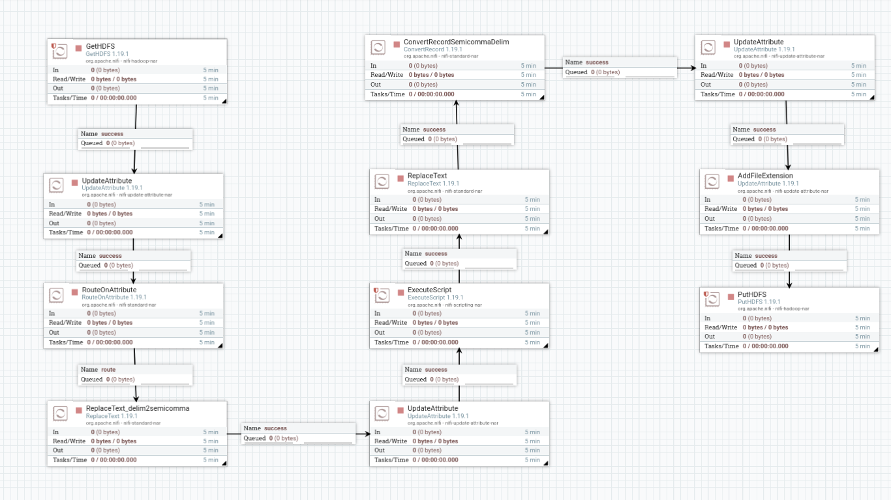

# Preparando Dados na Camada Silver para Consultas e Análises

## Bronze to Silver
Neste tópico, configuraremos um fluxo no NiFi para transformar e mover os dados da camada Bronze para a camada Silver no HDFS. A camada Silver é onde os dados são processados, padronizados e convertidos para formatos otimizados, como Parquet. O objetivo é garantir que os dados estejam organizados para estágios posteriores do pipeline de dados.

### Fluxo Completo
```
GetHDFS -> UpdateAttribute -> RouteOnAttribute -> ReplaceText (1) -> UpdateAttribute (2) -> ExecuteScript -> ReplaceText (2) -> ConvertRecord -> UpdateAttribute (3) -> UpdateAttribute (4) -> PutHDFS
```

    

## Controller Services
Os processadores no fluxo dependem de dois **Controller Services** configurados para gerenciar leitura e escrita de registros. Abaixo estão suas definições e configurações.


**CSVReader**: Leitura de arquivos CSV com configuração de esquema inferida.

| Configuração | Valor | Descrição |
| --- | --- | --- |
| Schema Access Strategy | `Infer Schema` | O esquema é inferido automaticamente com base no conteúdo do CSV. |
| Date Format | `yyyy-MM-dd` | Formato para leitura de datas. |
| Time Format | `HH:mm:ss` | Formato para leitura de tempos. |
| Timestamp Format | `yyyy-MM-dd HH:mm:ss` | Formato para leitura de timestamps. |
| CSV Format | `Custom` | Define um formato CSV customizado. |
| Value Separator | `;` | Utiliza ponto e vírgula como delimitador de valores. |
| Quote Character | `"` | Define aspas como caractere de citação. |
| Escape Character | `\` | Define barra invertida como caractere de escape. |
| Skip Header Line | `True` | Ignora a primeira linha se for um cabeçalho. |
| Character Set | `UTF-8` | Define a codificação do arquivo. |


**ParquetRecordSetWriter**: Escrita dos dados no formato Parquet.

| Configuração | Valor | Descrição |
| --- | --- | --- |
| Schema Access Strategy | `Inherit Schema` | Utiliza o esquema herdado do leitor de registros. |
| Compression Type | `UNCOMPRESSED` | Nenhuma compressão aplicada aos arquivos Parquet. |
| Avro Schema | `${avro.schema}` | Define o esquema Avro como atributo para converter para Parquet. |
| Row Group Size | `1000` | Tamanho do grupo de linhas no Parquet. |
| Cache Size | `1000` | Tamanho do cache para gravação dos arquivos. |
| Validation Enabled | `True` | Ativa validação durante a escrita. |


## Processadores do Fluxo
**1. GetHDFS**: Recupera arquivos da camada Bronze no HDFS.

| Configuração | Campo | Valor | Descrição |
| --- | --- | --- | --- |
| Properties | Hadoop Configuration | `/etc/hadoop/conf/` | Configuração do Hadoop |
|  | Directory | `/bronze` | Diretório da camada Bronze |
|  | Recursive Lookup | `true` | Busca recursiva nos subdiretórios |
| Relationships | success | - | Conexão para fluxo em caso de sucesso |


**2. UpdateAttribute**: Armazena informações úteis como a data atual e o caminho relativo do arquivo.

| Configuração | Campo | Valor | Descrição |
| --- | --- | --- | --- |
| Properties | current_date | `${now():format('yyyy-MM-dd')}` | Define a data atual formatada |
|  | relative_path | `${path:substringAfter('bronze/')}` | Extrai o caminho relativo do HDFS |
| Relationships | success | - | Conexão para fluxo em caso de sucesso |


**3. RouteOnAttribute**: Classifica arquivos para rotas específicas com base em atributos.

| Configuração | Campo | Valor | Descrição |
| --- | --- | --- | --- |
| Properties | filetype | `${filename:endsWith('.csv')}` | Rota para arquivos CSV |
| Relationships | success | - | Conexão para fluxo em caso de sucesso |


**4. ReplaceText (1)**: Substitui delimitadores nos arquivos CSV, padronizando-os para ponto e vírgula (`;`).

| Configuração | Campo | Valor | Descrição |
| --- | --- | --- | --- |
| Properties | Regular Expression | `[ ]` | Encontra tabulações |
|  | Replacement Value | `;` | Substitui por ponto e vírgula |
| Relationships | success | - | Conexão para fluxo em caso de sucesso |


**5. UpdateAttribute (2)**: Armazena o nome do arquivo sem a extensão.

| Configuração | Campo | Valor | Descrição |
| --- | --- | --- | --- |
| Properties | filename_no_ext | `${filename:replace('.csv','')}` | Remove a extensão `.csv` do nome do arquivo |
| Relationships | success | - | Conexão para fluxo em caso de sucesso |


**6. ExecuteScript**: Define cabeçalhos dinâmicos com base no nome do arquivo utilizando um script Groovy.

| Configuração | Campo | Valor | Descrição |
| --- | --- | --- | --- |
| Properties | Script Engine | `Groovy` | Linguagem de script utilizada |
|  | Script Body | **Ver script** | Lógica para mapear cabeçalhos e definir a variável `csv.header` |
| Relationships | success | - | Conexão para fluxo em caso de sucesso |


**7. ReplaceText (2)**: Adiciona o cabeçalho correspondente ao arquivo na primeira linha.

| Configuração | Campo | Valor | Descrição |
| --- | --- | --- | --- |
| Properties | Regular Expression | `^(.*)$` | Regex para manipular o conteúdo |
|  | Replacement Value | `${csv.header}\n\1` | Adiciona o cabeçalho na primeira linha |
| Relationships | success | - | Conexão para fluxo em caso de sucesso |


**8. ConvertRecord**: Converte arquivos CSV para o formato Parquet.

| Configuração | Campo | Valor | Descrição |
| --- | --- | --- | --- |
| Properties | Record Reader | `CSVReader` | Serviço para leitura de arquivos CSV |
|  | Record Writer | `ParquetRecordSetWriter` | Serviço para gravar em formato Parquet |
| Relationships | success | - | Conexão para fluxo em caso de sucesso |


**9. UpdateAttribute (3)**: Configura o diretório de saída no HDFS com base na estrutura lógica.

| Configuração | Campo | Valor | Descrição |
| --- | --- | --- | --- |
| Properties | output_directory | `${path:substringAfter('bronze/')}` | Define o diretório relativo para saída |
| Relationships | success | - | Conexão para fluxo em caso de sucesso |


**10. UpdateAttribute (4)**: Adiciona atributos específicos para facilitar a organização dos arquivos.

| Configuração | Campo | Valor | Descrição |
| --- | --- | --- | --- |
| Properties | directory | `${current_date}/${output_directory}` | Define a hierarquia de saída baseada na data |
| Relationships | success | - | Conexão para fluxo em caso de sucesso |


**11. PutHDFS**: Grava os arquivos convertidos no HDFS na camada Silver.

| Configuração | Campo | Valor | Descrição |
| --- | --- | --- | --- |
| Properties | Directory | `/silver/${directory}` | Diretório de saída na camada Silver |
|  | Conflict Resolution | `replace` | Substitui arquivos existentes |
| Relationships | success | - | Conexão para fluxo em caso de sucesso |


Após a execução do fluxo, os arquivos estarão na camada Silver no formato **Parquet**, organizados por data.

Exemplo:
```
/silver/
│── production
│   └── product
│       └── 2024-11-25
│           └── Product.parquet
```
