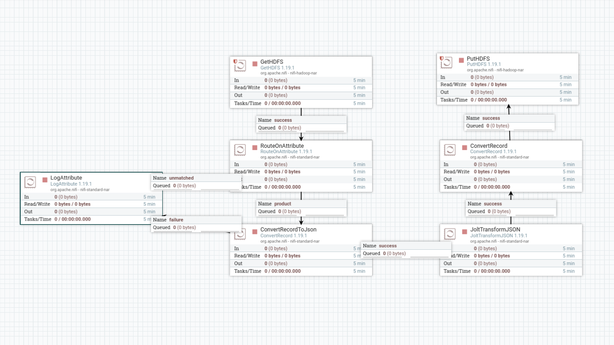

# **Otimização e Agregação de Dados na Camada Gold**

## Silver to Gold Layer
Neste tópico, configuraremos um fluxo no NiFi para criar a camada `gold` no HDFS. A camada gold representa a etapa final no pipeline de dados, onde as informações são otimizadas, enriquecidas e organizadas para análise e consumo por ferramentas de BI e machine learning.
O fluxo a seguir transforma os dados da camada silver, armazenados em formato Parquet, para a camada gold, mantendo apenas os atributos relevantes e garantindo alta performance na leitura e manipulação.


### Processos do Nifi
Utilizaremos os seguintes processadores no Nifi:

```
GetHDFS -> RouteOnAttribute -> ConvertRecord -> JoltTransformJson -> ConvertRecord -> PutHDFS
```

    

**GetHDFS**: recupera o arquivo `Product.parquet` do diretório `silver` no HDFS.
| Configuração | Campo            | Valor                          | Descrição                                               |
|------------------|----------------------|------------------------------------|-------------------------------------------------------------|
| Scheduling   | Run Schedule         | `86400 sec`                          | Equivalente a 1 dia em segundos                             |
| Properties       | Hadoop Configuration Resources                  | `/etc/hadoop/conf/core-site.xml,/etc/hadoop/conf/hdfs-site.xml` | Caminho para os arquivos de configuração do Hadoop necessários para acessar o HDFS                   |
|                  | Directory      | `/silver`         | Diretório dos arquivos de entrada                      |
|                  | Recursive Subdirectories     | `true`                            | Habilita a leitura recursiva de subdiretórios dentro de `/silver`   |
|                  | Keep Source File     | `true`                            | Mantém os arquivos de `/silver` após copiá-los para o `/gold`   |
|                  | File Filter Regex         | `.*\.parquet$`                         | Recupera todos os arquivos com extensão `.parquet`             |
| Relationships| success              | -                               | Conexão para o próximo fluxo em caso de sucesso                      |


**RouteOnAttribute**: identifica o arquivo `Product.parquet`.
> Caso precise manipular outros arquivos, este é o momento de configurar diferentes fluxos para arquivos específicos.
| Configuração | Campo              | Valor                                      | Descrição                                             |
|------------------|------------------------|----------------------------------------------|-----------------------------------------------------------|
| Properties   | Routing Strategy         | `Route to Property Name` | Define que o roteamento será baseado em propriedades |
|              | product         | `${filename:matches('.*Product.parquet')}` | Avalia se o nome do arquivo corresponde a `Product.parquet` |
| Relationships| product              | -                                            | Fluxo em caso de sucesso para `product`                                 |
| | unmatched              | `LogAttribute`                                            | Registra em log quando o arquivo não corresponde ao filtro definido                                 |


**ConvertRecord**: Converte os dados de Parquet para JSON para facilitar manipulações subsequentes.
| Configuração | Campo                     | Valor                                         | Descrição                                             |
|------------------|-------------------------------|-------------------------------------------------|-----------------------------------------------------------|
| Properties   | Record Reader                  | `ParquetReader` | Configurado para interpretar o arquivo Parquet                   |
|                  | Record Writer | `JsonRecordSetWriter`                                       | 	Converte os registros para JSON para transformações subsequentes       |
| Relationships| success                    | -                                     | Encaminha os dados transformados para o próximo fluxo                      |
|                  | failure                    | `LogAttribute`                                     | Registra falhas durante a conversão                        |


**JoltTransformJson**: Realiza a transformação e seleção de colunas no arquivo JSON.
> Este processador aplica um mapeamento para selecionar e reorganizar os atributos mais relevantes, garantindo uma estrutura ideal para a camada gold.
| Configuração | Campo                     | Valor                                         | Descrição                                             |
|------------------|-------------------------------|-------------------------------------------------|-----------------------------------------------------------|
| Properties   | Jolt Transformation DSL                  | `Chain` | Indica que múltiplas transformações serão aplicadas                   |
|                  | Jolt Specification | (definido abaixo)                                       | 	Mapeia os atributos selecionados       |
| Relationships| success                    | -                                     | 	Encaminha os dados transformados para o próximo fluxo                      |
|                  | failure                    | `terminate`                                     | Finaliza o fluxo em caso de falha                        |

*Jolt Specification:*
```
[
  {
    "operation": "shift",
    "spec": {
      "*": { 
        "ProductID": "[&1].ProductID",
        "Name": "[&1].Name",
        "Color": "[&1].Color",
        "SafetyStockLevel": "[&1].SafetyStockLevel",
        "StandardCost": "[&1].StandardCost",
        "ListPrice": "[&1].ListPrice",
        "Weight": "[&1].Weight",
        "ProductLine": "[&1].ProductLine",
        "Class": "[&1].Class",
        "Style": "[&1].Style",
        "Size": "[&1].Size"
      }
    }
  }
]
```


**ConvertRecord**: Converte o arquivo de volta para o formato Parquet.
| Configuração | Campo                     | Valor                                         | Descrição                                             |
|------------------|-------------------------------|-------------------------------------------------|-----------------------------------------------------------|
| Properties   | Record Reader                  | `JsonTreeReader` | Configurado para interpretar o arquivo JSON                   |
|                  | Record Writer | `ParquetRecordSetWriter`                                       | 	Grava os registros convertidos para o formato Parquet       |
| Relationships| success                    | -                                     | Encaminha os dados para a etapa final                      |
|                  | failure                    | `terminate`                                     | Finaliza o fluxo em caso de falha                        |


**PutHDFS**: Salva o arquivo no diretório `/gold` do HDFS.
| Configuração | Campo                     | Valor                                         | Descrição                                             |
|------------------|-------------------------------|-------------------------------------------------|-----------------------------------------------------------|
| Properties   | Hadoop Configuration Resources                  | `/etc/hadoop/conf/core-site.xml,/etc/hadoop/conf/hdfs-site.xml` | Caminho para os arquivos de configuração do Hadoop necessários para acessar o HDFS                   |
|                  | Directory | `/gold`                                       | 	Diretório final para armazenar os arquivos       |
|                  | Conflict resolution Strategy | `replace`                                          | Substitui arquivos existentes em caso de conflito             |
|                  | Writing Strategy | `Write and rename`                                          | Escreve o arquivo temporariamente e renomeia ao final para evitar corrupção             |
| Relationships| success                    | `terminate`                                     | Finaliza o fluxo em caso de sucesso                      |
|                  | failure                    | `terminate`                                     | Finaliza o fluxo em caso de falha                        |


Com essas etapas, garantimos que os dados na camada gold estejam limpos, organizados e otimizados para serem consumidos por ferramentas analíticas ou processos automatizados.