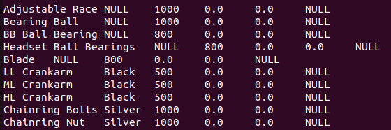
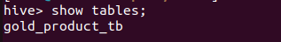

# **Criando Tabela Gold no Apache Hive**

## Introdução
Neste tutorial, aprenderemos a criar uma tabela externa no Apache Hive que referencie a camada gold armazenada no HDFS. Essa tabela estará pronta para ser consumida por ferramentas como o Apache Superset e outros sistemas analíticos.

O Apache Hive é uma ferramenta essencial em pipelines de dados, permitindo consultas SQL-like em grandes volumes de dados distribuídos. Ele suporta o uso de tabelas externas para que possamos acessar dados diretamente do HDFS, mantendo a flexibilidade e o desempenho necessários para ambientes de Big Data.

## Conectando ao Servidor Hive
Antes de iniciar, conecte-se ao ambiente onde o Hive está configurado:

1. Conecte-se ao servidor via SSH:

```
ssh -p 2122 devopstdp@localhost
Senha: tecnisystdp22 
```
2. Troque para o usuário `hive`:  
```
su - hive
```
3. Inicie o ambiente do Apache Hive:
```
hive
```
## Criando a Tabela Externa
Agora, criaremos uma tabela externa no Hive que aponta para os dados da camada gold, armazenados no diretório `/gold` no HDFS:
```
CREATE EXTERNAL TABLE IF NOT EXISTS gold_product_tb (
    Name STRING,
    Color STRING,
    SafetyStockLevel INT,
    StandardCost DOUBLE,
    ListPrice DOUBLE,
    Weight DOUBLE,
    ProductLine STRING,
    Class STRING,
    Style STRING,
    Size STRING
)
STORED AS PARQUET
LOCATION '/gold';
```

**O que esta tabela faz?**
- Tabela Externa: Permite acessar os dados diretamente no HDFS sem movimentá-los.
- Formato Parquet: Um formato otimizado para leitura e compressão eficiente.
- Colunas Selecionadas: Representam atributos principais do produto, como Name, Color, ListPrice, entre outros.

## Validando a Tabela
Após criar a tabela, valide se a tabela foi criada corretamente:
1. Execute o seguinte comando para verificar as tabelas criadas:
```
show tables;
```
    

2. Execute o seguinte comando para verificar a descrição da tabela:
```
desc gold_product_tb;
```
    

3. Execute o seguinte e valide se os dados estão acessíveis:
```
select * from gold_product_tb limit 10;
```
    

Com essas etapas, você configurou com sucesso uma tabela gold no Hive, proporcionando acesso a dados otimizados e prontos para análises avançadas. Essa estrutura será a base para criar dashboards dinâmicos e gerar insights estratégicos. 

Na próxima etapa, exploraremos como consumir essa tabela utilizando o Apache Superset, transformando os dados em visualizações impactantes!