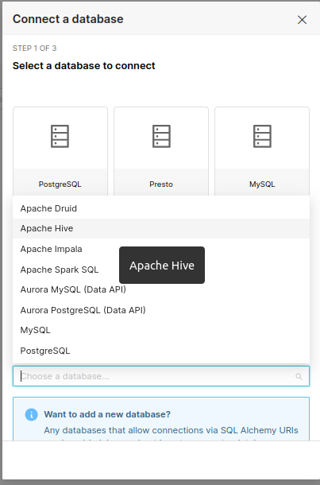
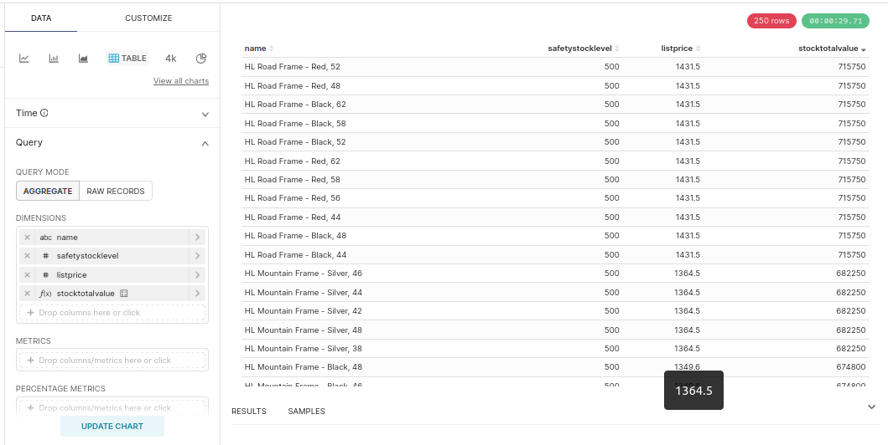
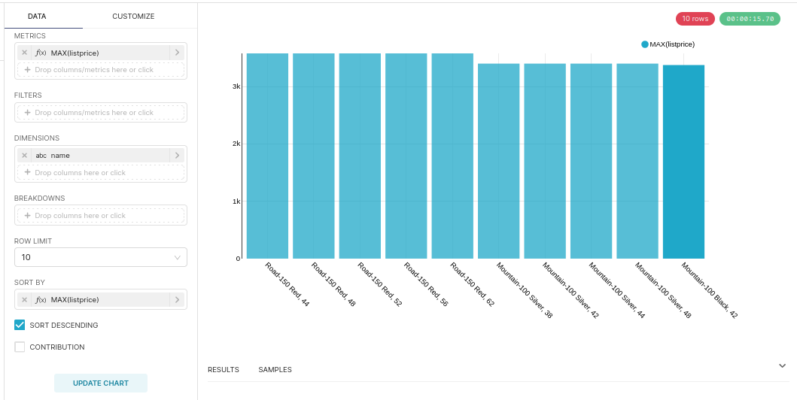
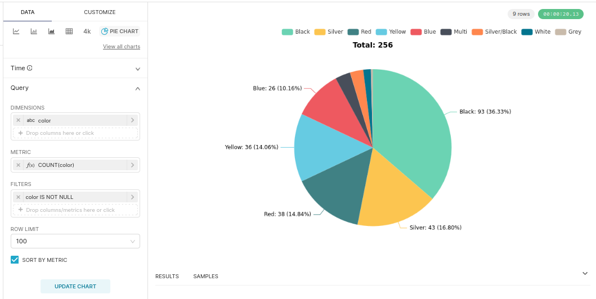
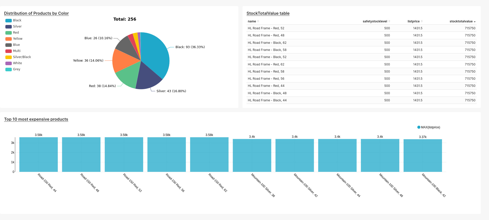

# **Explorando Dados no Apache Superset**

## Introdução
Neste tutorial, vamos explorar como conectar o Apache Superset ao Hive, criar gráficos relevantes e montar um dashboard completo para análises.

O Apache Superset é uma poderosa ferramenta open-source que permite criar visualizações interativas e dashboards a partir de diversas fontes de dados. Ele combina simplicidade e robustez, sendo ideal para extrair insights estratégicos e gerar relatórios dinâmicos.

## Acessando o Apache Superset
Para começar, acesse o Apache Superset através do link abaixo:  

[Superset Sandbox - Tecnisys](http://sandbox-tdp22.tecnisys.com.br:9088/login/)  


Credenciais de acesso:  
```
Login: admin
Senha: tecnisystdp22
```

Você pode importar um dashboard completo a partir dos **Recursos Disponíveis** mencionados em um tutorial anterior. No entanto, neste guia, vamos demonstrar passo a passo como conectar o Hive ao Superset e criar gráficos e dashboards personalizados.


## Conectando o Hive ao superset
1. No menu superior, vá para **Settings → Database Connection → + DATABASE**.  
2. Configure a conexão com o Hive e teste para garantir que está funcionando corretamente.


> Após esta etapa, sua conexão com o Hive estará estabelecida e pronta para criar visualizações dinâmicas.

## Criando Tabelas e Gráficos

### 1. Tabela de StockTotalValue

- 1. Acesse o menu superior e clique em `Charts → + CHART`
- 2. Selecione o dataset: `gold_product_tb`.  
- 3. Escolha o tipo de gráfico: `Table` e clique em `CREATE NEW CHART`.  

**Configurações:**  
| Configuração | Opção                     | Descrição                                |
|-------------------|-------------------------------|----------------------------------------------|
| Dimensions        | `name`                       | Nome do produto                              |
|                   | `safetystocklevel`           | Nível de estoque de segurança               |
|                   | `listprice`                  | Preço unitário                               |
|                   | `stocktotalvalue`            | Cálculo customizado: `listprice * safetystocklevel` |
| Filters           | `listprice > 0`             | Exclui produtos com preço igual a zero       |

> Resultado: Uma tabela com os valores totais de estoque calculados por produto.  


### 2. Gráfico de Barras: Top 10 Produtos Mais Caros

- 1. Acesse o menu superior e clique em `Charts → + CHART`
- 2. Selecione o dataset: `gold_product_tb`.  
- 3. Escolha o tipo de gráfico: `Bar Chart` e clique em `CREATE NEW CHART`.  

**Configurações:**  
| Configuração | Opção                     | Descrição                                |
|-------------------|-------------------------------|----------------------------------------------|
| Metrics           | `listprice`                  | Coluna de preço unitário                     |
| Dimensions        | `name`                       | Nome do produto                              |
| Row Limit         | `10`                         | Limita o gráfico aos 10 produtos mais caros  |
| Sort By           | `listprice` (Aggregate: MAX) | Ordena pela coluna de preço máximo           |
| Sort Descending   | `true`                       | Ordena de forma decrescente                  |

> Resultado: Um gráfico de barras mostrando os 10 produtos mais caros.  


### 3. Gráfico de Pizza: Distribuição de Produtos por Cor

- 1. Acesse o menu superior e clique em `Charts → + CHART`
- 2. Selecione o dataset: `gold_product_tb`.  
- 3. Escolha o tipo de gráfico: `Pie Chart` e clique em `CREATE NEW CHART`.  

| Configuração | Opção                     | Descrição                                |
|-------------------|-------------------------------|----------------------------------------------|
| Dimensions        | `color`                      | Representa a cor dos produtos                |
| Metrics           | `color` (Aggregate: COUNT)   | Conta o número de produtos por cor           |
| Filters           | `color is not null`          | Exclui valores nulos da coluna `color`       |
| Sort By Metric    | `true`                       | Ordena os valores pelo total da métrica      |

> Resultado: Um gráfico de pizza representando a distribuição dos produtos por cor.  



## Criando Nosso Primeiro Dashboard
Agora que temos gráficos e tabelas configurados, podemos combiná-los em um dashboard interativo.

- 1. No menu superior, vá para `Dashboards → + DASHBOARD`.  
- 2. Arraste e solte os gráficos e tabelas criados para o layout do dashboard.  
- 3. Ajuste o posicionamento conforme preferir.  
> Após organizar os elementos, você pode exportar o dashboard para compartilhar com sua equipe.


Este dashboard oferece uma **visão consolidada e estratégica do portfólio de produtos**, permitindo:
- Monitorar a distribuição por cores.
- Identificar os itens mais caros.
- Analisar o valor total de estoque. 

Ele é uma ferramenta essencial para **equipes de estoque, vendas, marketing e executivos**, pois fornece insights sobre tendências de mercado, preferências de clientes e a relação entre capital imobilizado e demanda. Este dashboard facilita a identificação de padrões e oportunidades, como:
- Ajustes no planejamento de produção
- Campanhas para produtos premium 
- Estratégias para otimizar o estoque e reduzir custos.

Seu valor está em **centralizar informações críticas para tomadas de decisão rápidas e assertivas**. Ele ajuda a melhorar a eficiência operacional, reduzir desperdícios e alinhar as ações da empresa com as demandas do mercado. A persona ideal para utilizá-lo seria uma gerente de estoque e planejamento, que busca equilibrar oferta e demanda, prever tendências e gerar relatórios claros para a liderança. 

Com este dashboard, profissionais podem agir com base em dados confiáveis, garantindo melhores resultados financeiros e maior agilidade na gestão.


## **Conclusão**
Com este tutorial, você aprendeu a conectar o Hive ao Superset, criar tabelas e gráficos personalizados, e montar um dashboard completo para análises interativas. Agora, você está pronto para transformar dados brutos em insights estratégicos!